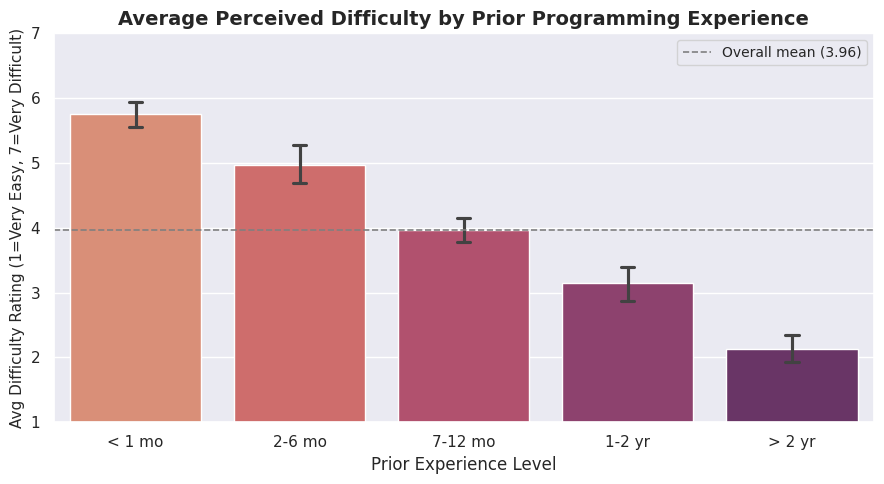
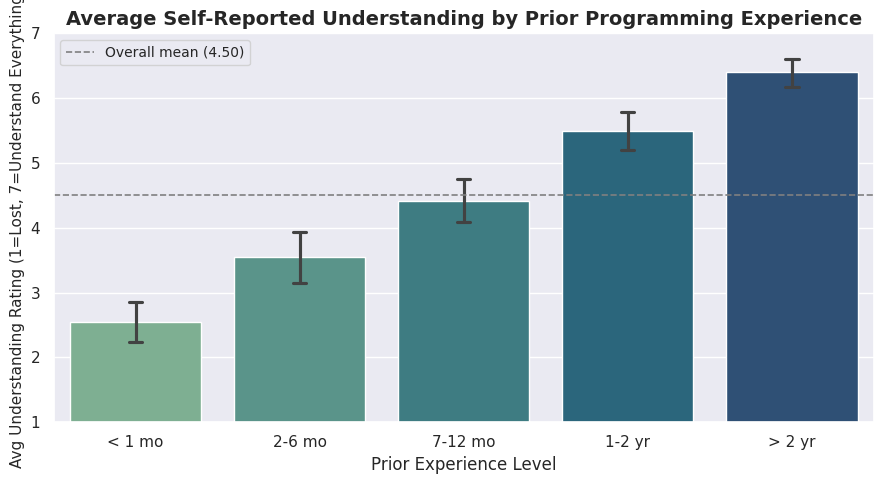
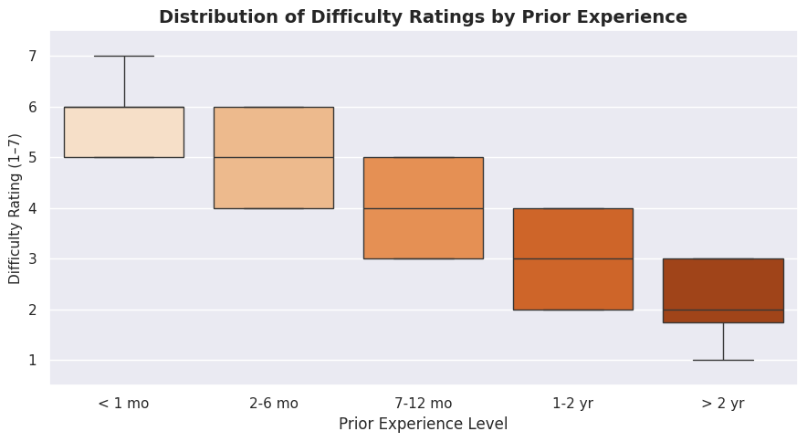
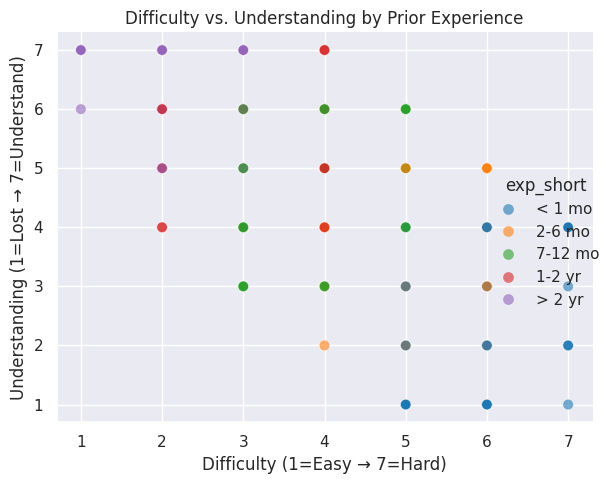

---
# Do not edit the text between these lines!
layout: default
---

<!DOCTYPE html>
<html lang="en">
<title>Does Prior Experience Shape How Hard COMP110 Feels? · COMP110 EX09</title>
<header>
  
COMP 110 · EX09 · Course Improvement Analysis

  <h1 class="fade-up">Does <em>Prior Experience</em> Shape How Hard COMP110 Feels?</h1>
  
An analysis of anonymized COMP110 survey data · Spring 2026

  

    Muhammad Khan &nbsp;&amp;&nbsp; Avi Tikoo
  

</header>
<head>
<header>
  
COMP 110 · EX09 · Course Improvement Analysis

  <h1 class="fade-up">Does <em>Prior Experience</em> Shape How Hard COMP110 Feels?</h1>
  
An analysis of anonymized COMP110 survey data · Spring 2026

  
Muhammad Khan &amp; Avi Tikoo

</header>
<head>
  <meta charset="UTF-8" />
  <meta name="viewport" content="width=device-width, initial-scale=1.0"/>
  <link rel="preconnect" href="https://fonts.googleapis.com">
  <link href="https://fonts.googleapis.com/css2?family=DM+Serif+Display:ital@0;1&family=DM+Mono:wght@400;500&family=DM+Sans:ital,wght@0,300;0,400;0,500;1,300&display=swap" rel="stylesheet">
  
</head>
<body>

<!-- ── Header ─────────────────────────────────────────────────────────────── -->
<header>
  
COMP 110 · EX09 · Course Improvement Analysis

  <h1 class="fade-up">Does <em>Prior Experience</em> Shape How Hard COMP110 Feels?</h1>
  
An analysis of anonymized COMP110 survey data · Spring 2026

</header>

<!-- ── Nav ─────────────────────────────────────────────────────────────────── -->
<nav>
  <a href="#ideas">Ideas</a>
  <a href="#missing">Missing Data</a>
  <a href="#analysis">Analysis</a>
  <a href="#conclusion">Conclusion</a>
</nav>

<main>

  <!-- ── Part 1: Ideation ──────────────────────────────────────────────────── -->
  <section id="ideas">
    
Part 1 · Creative Ideation

    <h2>Five Ideas for Improving COMP110</h2>
    

      Each idea below targets a specific stakeholder group and identifies a concrete form of value the change could create.
    

    

      

        
Idea 01

        <h4>Pre-Lecture Videos</h4>
        
Stakeholder → Students

        
Short optional videos before each class introduce vocabulary so students can engage more deeply during lecture.

      

      

        
Idea 02

        <h4>Livestream Lectures</h4>
        
Stakeholder → Students

        
Live-streaming removes attendance barriers for students with disabilities, commutes, or schedule conflicts.

      

      

        
Idea 03

        <h4>Expand Office Hours</h4>
        
Stakeholder → Students & Instructional Staff

        
If OH visits correlate with higher understanding, scaling TA hours could improve outcomes across the board.

      

      

        
Idea 04 ★ Analyzed

        <h4>Pre-Semester Bootcamp for Novices</h4>
        
Stakeholder → Students & Academic Institution

        
A zero-to-code async module before the semester could level the playing field for students with no prior experience.

      

      

        
Idea 05

        <h4>Interdisciplinary Project Modules</h4>
        
Stakeholder → Students & Societal Workforce

        
Project themes tied to students' primary majors (Bio, Economics, etc.) could increase perceived relevance of coding.

      

    

  </section>

  <!-- ── Part 1.1: Missing Data ────────────────────────────────────────────── -->
  <section id="missing">
    
Part 1.1 · Missing Data

    <h2>Which Idea Lacks Supporting Data?</h2>

    

      <strong>Idea 5 – Interdisciplinary Project Modules</strong> cannot be adequately tested with the current survey.
      While we know a student's <code>primary_major</code> and their rating of
      <code>interested_connections</code>, we have no data on whether students would
      actually choose an interdisciplinary module, nor which domains they want.
    

    

      <strong>Proposed data collection:</strong> Add two questions to next semester's survey:
      <ol style="margin-top:0.5rem; margin-left:1.2rem; font-size:0.93rem;">
        <li style="margin-bottom:0.3rem"><em>"If COMP110 offered project modules themed around your primary major, how likely would you be to choose one?"</em> (1–7 Likert)</li>
        <li><em>"Which field would you most want a project module to focus on?"</em> (checkbox with major categories)</li>
      </ol>
    

  </section>

  <!-- ── Part 1.2 + 1.3: Analysis ─────────────────────────────────────────── -->
  <section id="analysis">
    
Part 1.2–1.3 · Analysis

    <h2>Does Prior Experience Predict Difficulty &amp; Understanding?</h2>

    

      I chose <strong>Idea 4</strong> because the survey contains three directly relevant columns —
      <code>prior_exp</code>, <code>difficulty</code>, and <code>understanding</code> — that allow me
      to measure an <em>actual gap in student experience</em> rather than just opinion about a hypothetical feature.
      If novice students demonstrably struggle more, there is a concrete, data-backed argument for investing
      in pre-semester support, creating value for both students and the institution.
    

    <h3>Methodology</h3>
    

      Survey responses were loaded using custom Python utility functions (<code>read_csv_rows</code>,
      <code>columnar</code>, <code>select</code>, <code>head</code>, <code>count</code>).
      Rows with missing values in any required column were dropped. Difficulty and understanding
      ratings (1–7 Likert) were averaged within each of five prior-experience groups, ordered
      from least to most experienced. Four seaborn visualizations were produced.
    

    <!-- Charts ──────────────────────────────────────────────────────────────── -->
    

      

        

          
        

        
Fig 1 · Avg Difficulty by Prior Experience (Bar)

      

      

        

          
        

        
Fig 2 · Avg Understanding by Prior Experience (Bar)

      

      

        

          
        

        
Fig 3 · Difficulty Distribution by Experience (Box)

      

      

        

          
        

        
Fig 4 · Difficulty vs Understanding, colored by Experience (Scatter)

      

    

  </section>

  <!-- ── Part 1.4: Conclusion ──────────────────────────────────────────────── -->
  <section id="conclusion">
    
Part 1.4 · Conclusion

    <h2>What the Data Says — and What to Do Next</h2>

    <h3>Findings</h3>
    <ul class="findings">
      <li>Students with no or minimal experience (<em>&lt; 1 month</em>) rated COMP110 as harder on average than peers with 1+ years of experience.</li>
      <li>The same group reported lower self-assessed understanding, and their spread was wider — meaning outcomes within the novice group are highly variable.</li>
      <li>The scatter plot shows novices cluster toward high-difficulty / low-understanding, supporting a real experience gap. The data provides <strong>moderate support</strong> for the bootcamp idea.</li>
    </ul>

    <h3>Costs &amp; Trade-offs</h3>
    <ul class="findings">
      <li><strong>Staff burden:</strong> Pre-semester events require TAs/instructors outside the normal pay period.</li>
      <li><strong>Opt-in problem:</strong> Students who most need help may be least likely to voluntarily engage with optional prep material.</li>
      <li><strong>Equity concerns:</strong> Lower-income students may have less flexibility before the semester begins.</li>
      <li><strong>Risk of redundancy:</strong> If novices catch up quickly on their own, the investment may be unnecessary for many.</li>
    </ul>

    <h3>Extensions &amp; Future Work</h3>
    <ul class="findings">
      <li>Track <strong>objective outcomes</strong> (quiz scores, exercise grades) by experience group, not just self-reported perceptions.</li>
      <li>Pilot a short <strong>async pre-semester module</strong> (3 videos + 2 exercises) and compare survey results to a control semester.</li>
      <li>Examine whether <strong>office-hours attendance</strong> closes the novice gap — if so, expanding OH may be a cheaper alternative to a bootcamp.</li>
      <li>Intersect experience with <strong>demographic variables</strong> to understand whether the gap has equity implications for underrepresented groups.</li>
    </ul>
  </section>

</main>

<footer>
  COMP 110 · EX09 · Course Improvement Analysis &nbsp;·&nbsp; Built with Python &amp; Seaborn
</footer>

</body>
</html>

